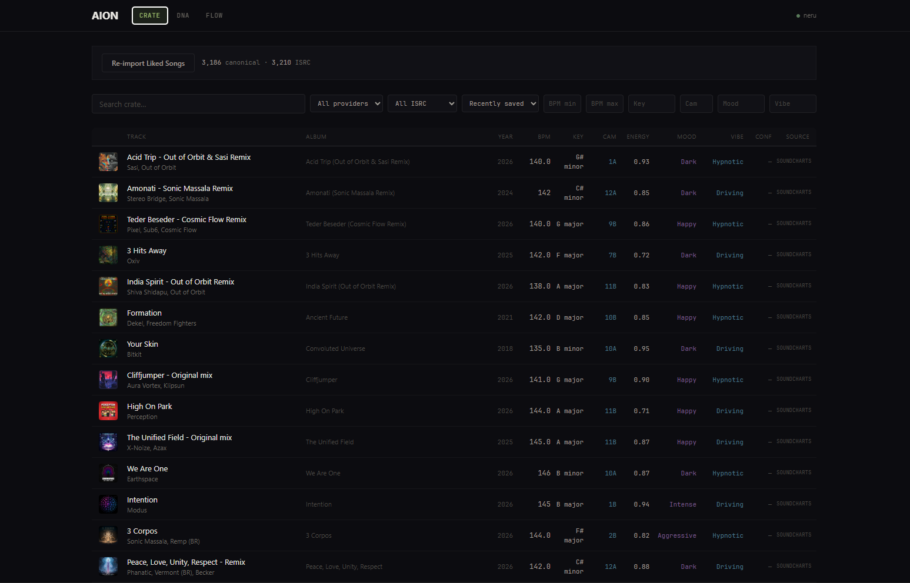
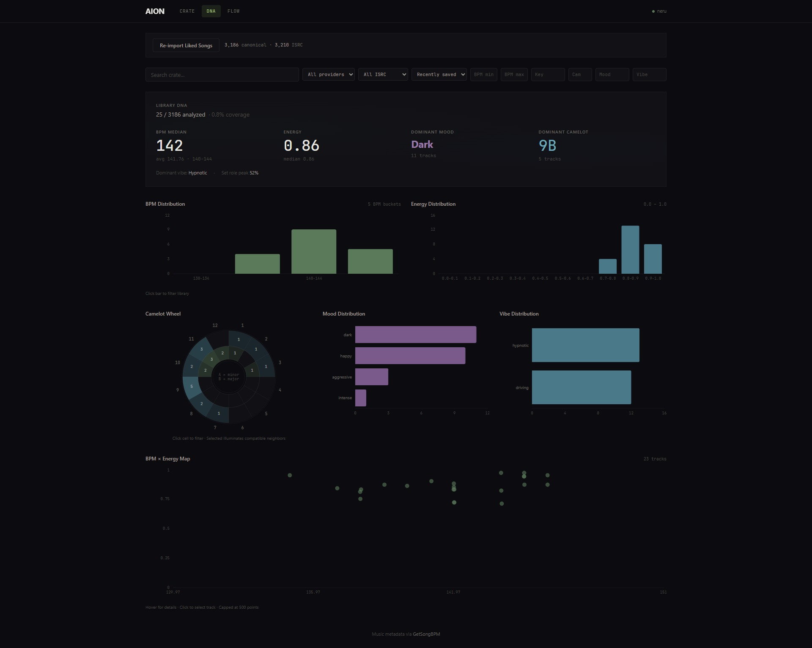
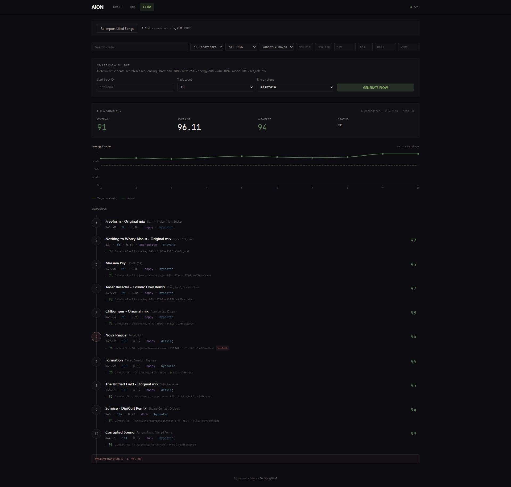

# AION

**A browser-based music intelligence and DJ workflow system.**

AION imports a music library, enriches tracks with musical metadata, derives higher-level musical character, analyzes the library visually, scores DJ transitions, recommends the next track, and generates optimized multi-track DJ flows.

It started as a way to answer basic DJ questions about a Spotify library — what is 140 BPM, what is harmonically compatible, what feels dark or hypnotic, what should come next. That playlist-sorting idea turned into a provider-independent musical intelligence platform.

---



---

## What AION Does

```
Spotify / Music Provider
        ↓
Canonical Track Model (ISRC, deduplication)
        ↓
Metadata Enrichment (BPM, key, energy, danceability, ...)
        ↓
Music Theory (Camelot mapping, harmonic compatibility)
        ↓
Mood / Vibe Inference (euphoric, dark, hypnotic, driving, ...)
        ↓
Library DNA (analytics, distributions, coverage)
        ↓
Transition Intelligence (deterministic 0–100 scoring)
        ↓
Best Next Track (ranked recommendations)
        ↓
Smart Flow (beam-search multi-track DJ set optimization)
        ↓
Saved Flows + Export (TXT, CSV, JSON, Spotify)
```

AION distinguishes between **raw provider data** (what Spotify or Soundcharts give you) and **AION-derived intelligence** (what the system calculates from that data). This distinction matters: AION is not relabeling provider metadata. It is computing new signals — Camelot keys, mood profiles, transition scores, energy curves — from real audio features, with full provenance.

---

## Crate


The Crate is the library explorer. It shows every imported track with its musical metadata — BPM, key, energy, mood, vibe — and lets you search, filter, and sort across the full library.

Each track has a detail panel showing enrichment provenance: where the data came from, what version of the analysis was used, and what confidence exists. Nothing is hidden behind a black box.

Key capabilities:
- Search by title, artist, album
- Filter by BPM range, key, energy, mood, vibe
- Sort by any musical attribute
- Pagination across thousands of tracks
- Track inspector with full metadata and enrichment history

---

## Library DNA



Library DNA gives you a visual overview of your collection as a musical system. It answers questions like: what is the BPM distribution of my library? Where are my harmonic clusters? What moods dominate? How much of my library is actually enriched?

Visualizations include:
- **Camelot wheel** — harmonic distribution across all 24 keys
- **BPM distribution** — tempo histogram with range controls
- **Energy distribution** — energy profile across the library
- **Mood distribution** — breakdown of inferred mood categories
- **Vibe distribution** — breakdown of inferred vibe categories
- **BPM × Energy constellation** — scatter plot revealing tempo-energy clusters

All visualizations respect enrichment coverage honestly. If only a subset of tracks has BPM data, the charts say so.

---

## Transition Intelligence

AION scores how well any two tracks work together as a DJ transition. The scoring is deterministic, explainable, and weighted:

| Component | Weight |
|-----------|--------|
| Harmonic compatibility | 30% |
| BPM compatibility | 25% |
| Energy compatibility | 20% |
| Vibe similarity | 10% |
| Mood similarity | 10% |
| Set-role compatibility | 5% |

Each transition result includes:
- **Total score** (0–100)
- **Component breakdown** — exactly how much each factor contributed
- **Reasons** — human-readable explanations (e.g., "same Camelot key", "BPM within ±3")
- **Warnings** — potential issues (e.g., large energy drop, mood mismatch)

Energy intents let you steer transitions: **maintain**, **build**, or **drop** energy.

**Best Next Track** takes a current track and ranks all suitable next tracks from the library, ordered by transition score.

---

## Smart Flow



Smart Flow generates optimized multi-track DJ sets using beam-search sequencing. Given a starting track and a target length, it finds the sequence that maximizes transition quality while following an energy shape.

**Energy shapes:**
- `maintain` — steady energy throughout
- `build` — gradual energy increase
- `drop` — energy decrease
- `wave` — oscillating energy
- `peak_middle` — energy peaks in the middle
- `peak_end` — energy peaks at the end

**Optimization objective:**
```
0.5 × average transition score
+ 0.3 × minimum transition score (weakest link)
+ 0.2 × energy-shape fit
```

**Constraints:**
- Start track
- Track count
- BPM range
- Camelot range
- Mood / vibe filters
- Set-role filters
- Minimum transition score
- Artist repetition control

The output includes the full sequence, per-transition explanations, the energy curve, and the weakest link — so you know exactly where the set might need manual adjustment.

---

## How the Intelligence Works

AION does not just pass through provider labels. It computes new signals:

| Layer | What the provider gives | What AION derives |
|-------|------------------------|-------------------|
| Raw data | BPM = 140, Energy = 0.93, Key = G# minor | — |
| Music theory | — | Camelot = 1A, harmonic compatibility score |
| Character | — | Mood = dark, Vibe = hypnotic, Set role = peak |
| Transitions | — | Compatibility = 87, reasons, warnings |
| Sequencing | — | Optimal 10-track flow, energy curve, weakest link |

Every derived value carries provenance: the source it came from, the analysis version that produced it, and the confidence level. This is not metadata decoration. It is a separate intelligence layer built on top of real audio features.

---

## Architecture

```
┌─────────────────────────────────────────────┐
│              Web (Next.js 14)                │
│    React · TypeScript · Tailwind · Recharts  │
└──────────────────────┬──────────────────────┘
                       │ /api/*
┌──────────────────────▼──────────────────────┐
│            FastAPI (Python 3.11+)            │
│   Routes · Services · Providers · Enrichment │
└────┬──────────────┬──────────────┬──────────┘
     │              │              │
┌────▼────┐  ┌──────▼──────┐  ┌───▼──────────┐
│ Spotify │  │ Soundcharts │  │  MusicBrainz  │
│ Provider│  │  Enrichment │  │  ISRC Resolve │
└─────────┘  └─────────────┘  └──────────────┘
     │              │              │
┌────▼──────────────▼──────────────▼──────────┐
│         SQLAlchemy 2 · Alembic · SQLite      │
│      Track · TrackAttribute · ProviderTrack  │
└─────────────────────────────────────────────┘
```

**Frontend:** Next.js 14, React 18, TypeScript, Tailwind CSS, Recharts

**Backend:** FastAPI, Python 3.11+, SQLAlchemy 2, Alembic

**Database:** SQLite (local development)

**Providers:** Spotify (OAuth + PKCE), Soundcharts (client credentials), GetSongBPM (API key), MusicBrainz (anonymous)

**Design principle:** Modular monolith with provider-independent domain models. A new provider implements the same interfaces; nothing else changes.

---

## Core Domains

| Domain | Description |
|--------|-------------|
| Track identity | Canonical recording model with ISRC, deduplication, provider mapping |
| Enrichment | BPM, key, energy, danceability, and audio features with provenance |
| Music theory | Camelot mapping, harmonic compatibility, enharmonic normalization |
| Music character | Deterministic mood, vibe, and set-role inference from audio features |
| Library analytics | DNA summaries, distributions, coverage stats, visual charts |
| Transitions | Deterministic 0–100 scoring with explainable components |
| Smart Flow | Beam-search DJ set optimization with energy shaping |
| Saved flows | Persistence, CRUD, export (TXT, CSV, JSON, Spotify) |

---

## Explainability

AION deliberately exposes what most systems hide:

- **Data source** — every attribute knows where it came from
- **Confidence** — enrichment results carry confidence scores
- **Model version** — which analysis version produced this data
- **Transition components** — exactly why two tracks scored the way they did
- **Recommendation reasons** — human-readable explanations for every suggestion
- **Missing data** — honest about what is not enriched rather than guessing

This is not a feature checkbox. It is the core design philosophy. If AION cannot explain why it recommended a transition, the recommendation is not useful.

---

## Current Status

| Area | Status |
|------|--------|
| Spotify Library Import | Done |
| Canonical Track Model (ISRC, dedup) | Done |
| MusicBrainz Identity Resolution | Done |
| Soundcharts Enrichment | Done |
| GetSongBPM Fallback | Done |
| Camelot / Harmonic Analysis | Done |
| Mood / Vibe Inference | Done |
| Library DNA Analytics | Done |
| Transition Intelligence | Done |
| Best Next Track | Done |
| Smart Flow Optimization | Done |
| Organic-Tech Visual System | Done |
| Saved Flows + CRUD | Done |
| TXT / CSV / JSON Export | Done |
| Spotify Playlist Export | Blocked — 403 on live API |

---

## Running Locally

### Backend

```bash
cd "apps/api"
python -m venv .venv
.venv\Scripts\Activate.ps1
pip install -e .
alembic upgrade head
python -m uvicorn app.main:app --reload --port 8000
```

### Frontend

```bash
cd "apps/web"
npm install
npm run dev
```

Open [http://localhost:3000](http://localhost:3000).

### Configuration

```bash
copy .env.example .env
```

Edit `.env` with your Spotify and Soundcharts credentials. The `.env` file is gitignored and never committed.

---

## Tests

### Backend

```bash
cd apps/api
python -m pytest -q
```

**343 tests passing** — covering enrichment, transitions, smart flow, saved flows, API endpoints, and provider parsing.

### Frontend

```bash
cd apps/web
npm run typecheck
npm run build
```

Both pass cleanly.

---

## Current Dataset

| Metric | Value |
|--------|-------|
| Canonical tracks | 3,186 |
| Spotify occurrences | 3,211 |
| Tracks enriched (Soundcharts) | 25 (~0.8%) |

The intelligence pipeline works end-to-end. The current local dataset has a small enriched subset because enrichment is rate-limited (~1 req/sec against the Soundcharts API). Full-library enrichment is the next scaling step.

---

## Known Limitations

- **Enrichment coverage** — only a small subset of the library is currently enriched with BPM/key/energy data
- **No phrase detection** — transitions are scored on metadata, not musical phrasing
- **No beat-grid alignment** — no quantized beat-level analysis
- **No cue point detection** — no intro/outro/breakpoint modeling
- **No waveform analysis** — no audio-level transition intelligence
- **No vocal-clash detection** — no frequency-domain conflict analysis
- **Heuristic mood/vibe** — derived from audio features, not genre-trained classifiers
- **Spotify export** — playlist creation returns 403 Forbidden (likely a Spotify Developer Dashboard configuration issue, not a code defect)
- **Desktop-first UI** — not optimized for mobile screens

These are technical boundaries, not oversights. Each represents a clear area for future work.

---

## Roadmap

- Full-library Soundcharts enrichment
- Spotify export configuration resolution
- Deeper audio analysis (phrase, beat-grid, waveform)
- Optional local audio analysis ( Essentia / Librosa)
- Rekordbox / Serato interoperability
- Improved personalized character and transition models

---

## Why I Built This

I originally wanted a way to take the thousands of tracks sitting in my Spotify Liked Songs and answer basic DJ questions: what is 140 BPM, what is harmonically compatible, what feels dark or hypnotic, and what should come next? That simple playlist-sorting idea gradually turned into AION — a system that does not just sort playlists but reasons about music as a structured, composable, explainable domain.

---

## License

Not yet specified.
